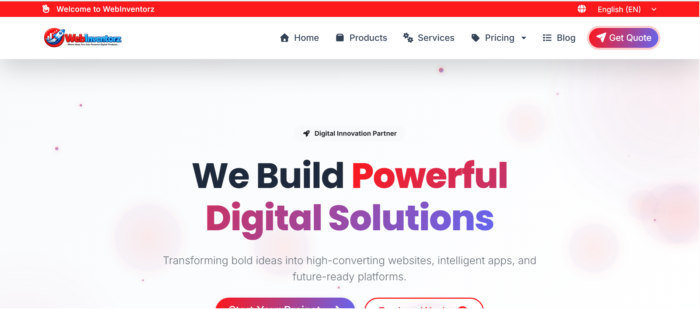
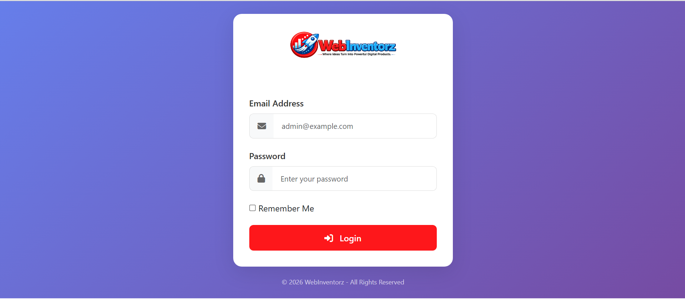
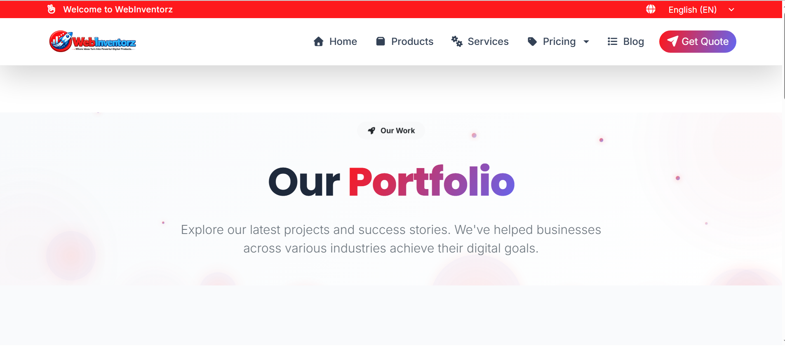
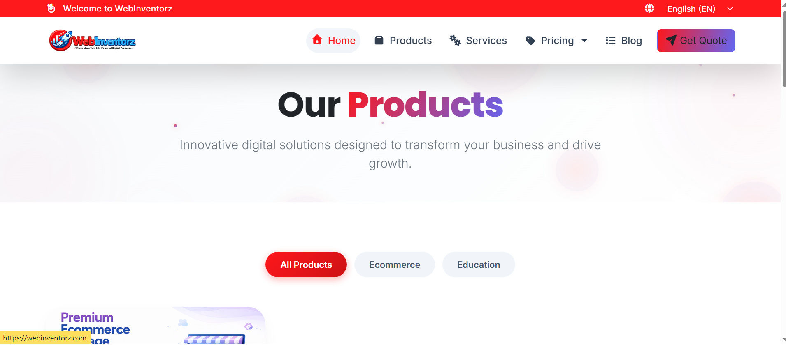
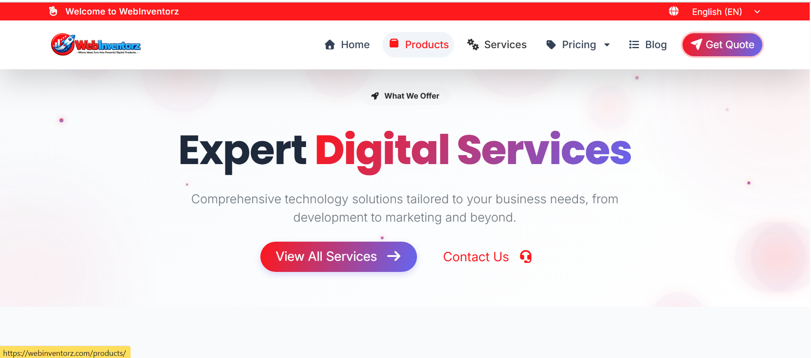
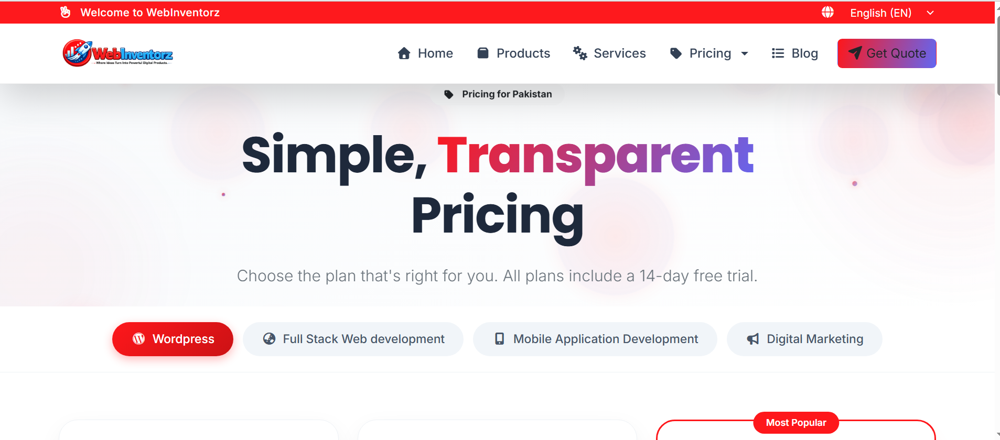
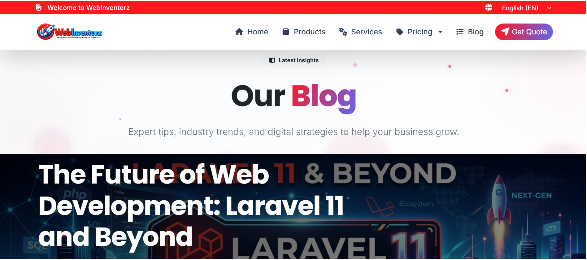
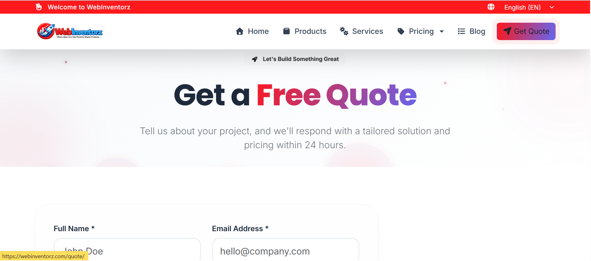

# 🚀 WebInventorz - Digital Agency Portfolio Website

<p align="center">
  
</p>

<p align="center">


</p>

---

# 🌐 Live Website

### 🔗 https://webinventorz.com/

---

# 📖 Project Overview

**WebInventorz** is a modern Digital Agency website built to showcase professional digital services, products, pricing plans, portfolios, blogs, and lead generation.

The platform presents a premium online presence for a software agency while providing a smooth and engaging user experience across all devices.

The website focuses on:

- Professional Branding
- Service Presentation
- Product Showcase
- Portfolio Display
- Dynamic Pricing
- Lead Generation
- Business Growth

---

# ✨ Key Features

- Modern UI/UX Design
- Fully Responsive Layout
- Professional Landing Page
- Products Showcase
- Services Section
- Dynamic Pricing
- Portfolio Gallery
- Blog System
- Quote Request Form
- Authentication Pages
- SEO Friendly Structure
- Fast Performance
- Mobile Optimized
- Reusable Components
- Smooth Navigation
- Clean Code Architecture

---

# 🖥️ Website Pages

## 🏠 Home

- Beautiful Hero Section
- Company Introduction
- Featured Services
- Featured Products
- Statistics
- Call To Action
- Modern Layout

---

## 📦 Products

- Digital Products Showcase
- Software Solutions
- Education Products
- Ecommerce Products
- Featured Products

---

## 💼 Services

- Web Development
- Mobile App Development
- UI/UX Design
- Digital Marketing
- SEO Services
- Custom Software Development

---

## 💰 Pricing

- Multiple Pricing Plans
- Transparent Packages
- Pakistan Pricing
- Free Trial Section
- Popular Plan Highlight

---

## 📰 Blog

- Latest Articles
- Technology Updates
- Development Tutorials
- Industry Insights

---

## 🎯 Portfolio

- Company Projects
- Success Stories
- Project Showcase
- Portfolio Gallery

---

## 📝 Get Quote

- Contact Form
- Lead Generation
- Business Inquiry
- Client Information Collection

---

## 🔐 Login

- Secure Authentication UI
- Email Login
- Password Login
- Remember Me Option

---

# ⚙️ Dynamic CMS Features

This project is designed with a fully manageable backend.

### Content Management

- Homepage Content
- Products
- Services
- Pricing Plans
- Blogs
- Portfolio
- Testimonials
- Contact Information
- SEO Settings

---

### Admin Panel

- Dashboard
- User Management
- Role Management
- Portfolio Management
- Blog Management
- Product Management
- Service Management
- Pricing Management
- Quote Requests
- Testimonials
- Analytics Dashboard

---

# 🚀 Technology Stack

## Frontend

- Next.js
- React
- TypeScript
- Tailwind CSS
- HTML5
- CSS3
- JavaScript

---

## Backend Ready

- REST APIs
- CMS Integration
- Authentication
- Database Support
- Dynamic Content Management

---

# 📱 Responsive Design

- Desktop
- Laptop
- Tablet
- Mobile

---

# 🎯 Performance Highlights

- SEO Optimized
- Fast Loading
- Clean UI
- Optimized Images
- Responsive Components
- Scalable Architecture
- Reusable Code
- Modern Design Principles

---

# 📸 Screenshots

## 🏠 Homepage


---

## 🔐 Login



---

## 💼 Portfolio



---

## 📦 Products



---

## 🛠️ Services



---

## 💰 Pricing



---

## 📰 Blog



---

## 📝 Get Quote



---

# 📂 Project Structure

```
app/
│
├── page.tsx
├── layout.tsx
├── globals.css
├── services/
├── testimonials/
├── terms/
│
public/
│
screenshot/
├── blog.png
├── loader.png
├── login.png
├── portfilo.png
├── pricing.png
├── products.png
├── qoute.png
├── services.png
└── webinventorz.png
```

---

# 💼 Project Goals

✔ Build trust with potential clients

✔ Showcase digital products

✔ Display company portfolio

✔ Generate qualified leads

✔ Increase business conversions

✔ Professional online branding

---

# 🌟 Highlights

- Pixel Perfect Design
- Professional UI
- Reusable Components
- Modular Architecture
- Mobile First
- Clean Folder Structure
- Easy Maintenance
- Production Ready

---

# 👨‍💻 Developed By

**Muhammad Asad**

Full Stack Web & Mobile Application Developer

### Skills

- Laravel
- Livewire
- PHP
- Next.js
- React.js
- TypeScript
- JavaScript
- Bootstrap
- Tailwind CSS
- MySQL
- REST APIs

---

# 📬 Contact

🌐 Portfolio: https://asadmukhtar.online

📧 Email: contact@asadmukhtar.online

💼 LinkedIn: https://linkedin.com/in/asadmukhtar

🐙 GitHub: https://github.com/asadmukhtarr

---

# ⭐ Support

If you like this project, don't forget to **⭐ Star** the repository.